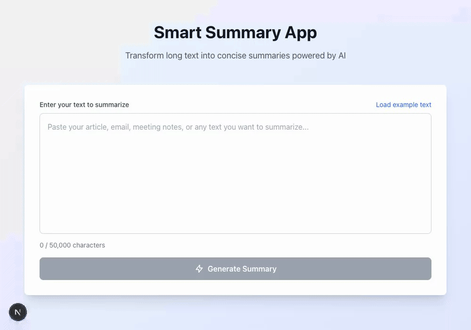

# Smart Summary

**AI-powered text summarization with real-time streaming.**

Paste any text and watch a structured, markdown-formatted summary materialize word by word -- powered by GPT-4o-mini and delivered through Server-Sent Events.

[](https://github.com/willianpinho/smart-summary-app/actions)
[](https://www.typescriptlang.org/)
[](https://python.org)
[](https://nextjs.org)
[](https://fastapi.tiangolo.com)
[](LICENSE)

🔗 **Live Demo:** [https://smart-summary.dev.willianpinho.com](https://smart-summary.dev.willianpinho.com)

---

## Demo



_Real-time SSE streaming: the summary renders section by section as tokens arrive from the model — a live progress bar tracks words and characters as they land._

---

## Features

| Feature                         | Description                                                                                                           |
| ------------------------------- | --------------------------------------------------------------------------------------------------------------------- |
| **Real-time streaming**         | SSE-based progressive text rendering -- summary appears word by word                                                  |
| **Markdown output**             | Structured summaries with headers, bold highlights, and bullet points via `@tailwindcss/typography`                   |
| **Prompt injection resistance** | System-prompt role isolation: the model is told the user's text is content to summarize, never instructions to follow |
| **Input validation**            | 10--50,000 character range and a basic spam/DoS pattern check, enforced on both client and server                     |
| **Dark mode**                   | System-aware theme switching with Tailwind                                                                            |
| **Copy to clipboard**           | One-click copy of the generated summary                                                                               |
| **Example text loader**         | Pre-loaded sample text for instant demo                                                                               |
| **CORS security**               | Allowlist restricted to `localhost` and the production frontend origin                                                |

---

## Architecture

```
                                    POST /api/summarize
 ┌──────────────┐    HTTPS     ┌──────────────────┐    OpenAI SDK    ┌─────────────┐
 │              │ ───────────> │                  │ ──────────────> │             │
 │   Next.js    │              │     FastAPI      │                  │   OpenAI    │
 │   React 19   │ <─────────── │   Python 3.11    │ <────────────── │  GPT-4o-mini│
 │              │  SSE stream  │                  │  stream chunks  │             │
 └──────────────┘              └──────────────────┘                  └─────────────┘
    Port 3000                      Port 8000                          External API
```

### Data Flow

1. User pastes text into the React form
2. Client-side validation enforces length and format constraints
3. `POST /api/summarize` sends the text to FastAPI
4. Server-side validation enforces length bounds and a basic spam pattern check; the system prompt isolates the user's text as content, not instructions
5. FastAPI opens a streaming chat completion request to OpenAI (GPT-4o-mini, temperature 0.3)
6. Each token is relayed to the client as its own SSE event the moment it arrives -- no server-side buffering
7. The frontend renders the summary progressively with `react-markdown` and `@tailwindcss/typography`

### Key Design Decisions

| Decision                     | Rationale                                                                                                                                                                     |
| ---------------------------- | ----------------------------------------------------------------------------------------------------------------------------------------------------------------------------- |
| **FastAPI middleware layer** | Keeps the OpenAI API key server-side, centralizes validation, enables logging and rate limiting without exposing secrets to the browser                                       |
| **SSE over WebSockets**      | Summarization is unidirectional (server to client). SSE is simpler, has native browser support via `EventSource`, and avoids the connection management overhead of WebSockets |
| **GPT-4o-mini**              | Optimal cost-quality tradeoff for summarization ($0.15/1M input tokens, sub-2s latency)                                                                                       |
| **True token streaming**     | Each OpenAI delta is forwarded to the client immediately (`async for chunk in stream: yield ...`), so time-to-first-token reflects real generation, not the full completion   |

---

## Tech Stack

| Layer        | Technology                                      | Purpose                              |
| ------------ | ----------------------------------------------- | ------------------------------------ |
| **Frontend** | Next.js 16, React 19, TypeScript 5.6            | App Router, server/client components |
| **Styling**  | Tailwind CSS, `@tailwindcss/typography`         | Utility-first CSS, prose rendering   |
| **Backend**  | FastAPI 0.115, Python 3.11, Pydantic 2.9        | Async API, streaming, validation     |
| **AI**       | OpenAI SDK, GPT-4o-mini                         | Chat completions with streaming      |
| **Testing**  | Jest, React Testing Library, Playwright, Pytest | Unit, component, E2E, API tests      |
| **CI/CD**    | GitHub Actions                                  | Lint, test, build, deploy            |
| **Hosting**  | Hetzner VPS via Docker (frontend + backend)     | Self-hosted deploy, single backend   |

---

## Quick Start

### Prerequisites

- Node.js 18+ and pnpm
- Python 3.11+
- An [OpenAI API key](https://platform.openai.com/api-keys)

### 1. Clone and configure

```bash
git clone https://github.com/willianpinho/smart-summary-app.git
cd smart-summary-app

# Create environment file
cp .env.example .env   # or create manually
```

Add your API key to `.env`:

```
OPENAI_API_KEY=sk-...
```

### 2. Start the backend

```bash
cd backend
python -m venv venv
source venv/bin/activate   # Windows: venv\Scripts\activate
pip install -r requirements.txt
python main.py
```

The API will be available at `http://localhost:8000` with interactive docs at `http://localhost:8000/docs`.

### 3. Start the frontend

```bash
cd frontend
pnpm install
pnpm dev
```

Open `http://localhost:3000` in your browser.

---

## Environment Variables

| Variable              | Location        | Required | Default                 | Description                             |
| --------------------- | --------------- | -------- | ----------------------- | --------------------------------------- |
| `OPENAI_API_KEY`      | Backend `.env`  | Yes      | --                      | OpenAI API key for GPT-4o-mini          |
| `NEXT_PUBLIC_API_URL` | Frontend `.env` | No       | `http://localhost:8000` | Backend API base URL                    |
| `ALLOWED_ORIGINS`     | Backend `.env`  | No       | --                      | Comma-separated additional CORS origins |

---

## Testing

The project maintains **64 tests** across three layers with 89% backend coverage.

### Backend (24 tests)

```bash
cd backend
source venv/bin/activate

pytest -v                                  # Run all tests
pytest --cov=main --cov-report=term-missing  # With coverage report
```

Covers: endpoint responses, input validation, prompt safety (system-prompt isolation), SSE streaming, error handling.

### Frontend Unit Tests (26 tests)

```bash
cd frontend

pnpm test                 # Run all unit tests
pnpm test:watch           # Watch mode
pnpm test:coverage        # Coverage report
```

Covers: component rendering, form validation, streaming display, snapshot regression.

### E2E Tests (14 tests)

```bash
cd frontend

pnpm exec playwright install  # First time only
pnpm e2e                      # Headless
pnpm e2e:ui                   # Interactive UI mode
```

Covers: full summarization flow, form validation, example text loading, error states, clipboard copy.

---

## API Reference

### `GET /`

Health check.

```json
{ "status": "healthy", "service": "Smart Summary API", "version": "1.0.0" }
```

### `GET /health`

Detailed health check including OpenAI configuration status.

```json
{
  "status": "healthy",
  "openai_configured": true,
  "service": "Smart Summary API"
}
```

### `POST /api/summarize`

Streams a markdown-formatted summary via Server-Sent Events.

**Request:**

```json
{ "text": "Your long text here (10-50,000 characters)..." }
```

**Response** (`text/event-stream`, one event per OpenAI token as it arrives):

```
data: ##
data:  Overview
data: \n\nThis
data:  is a
data:  summary...
data: [DONE]
```

**Error codes:**

| Status | Reason                                                                        |
| ------ | ----------------------------------------------------------------------------- |
| `422`  | Validation error -- text too short, too long, or suspicious patterns detected |
| `500`  | Internal server error (logged server-side, generic message returned)          |

---

## Project Structure

```
smart-summary-app/
├── backend/
│   ├── main.py                 # FastAPI application (routes, validation, streaming)
│   ├── test_main.py            # 24 Pytest tests
│   └── requirements.txt
│
├── frontend/
│   ├── app/                    # Next.js App Router
│   │   ├── page.tsx            # Home page
│   │   ├── layout.tsx          # Root layout with metadata
│   │   └── globals.css         # Tailwind base styles
│   ├── components/
│   │   ├── SummaryForm.tsx     # Text input form with validation
│   │   ├── SummaryDisplay.tsx  # Streaming summary renderer
│   │   ├── FormattedSummary.tsx# Markdown prose component
│   │   └── StreamingProgress.tsx # Progress indicator
│   ├── lib/
│   │   └── config.ts           # API URL configuration
│   ├── __tests__/              # Jest + RTL unit tests
│   ├── e2e/                    # Playwright E2E tests
│   ├── playwright.config.ts
│   ├── jest.config.js
│   └── tailwind.config.js
│
├── .github/workflows/          # CI/CD pipeline
└── README.md
```

---

## Deployment

### Hetzner VPS (Docker) -- canonical

Push to the `development` branch triggers `.github/workflows/deploy-dev.yml`: it builds Docker images for both `backend/Dockerfile` and `frontend/Dockerfile`, pushes them to GHCR, and deploys both to the Hetzner VPS via SSH. This is the only backend deploy target -- the domain below is what the live demo actually runs on, and matches the CORS allowlist and Traefik routing committed in this repo.

- Frontend: `smart-summary.dev.willianpinho.com`
- Backend: `api.smart-summary.dev.willianpinho.com`

### CI Pipeline

Every push and pull request triggers the GitHub Actions workflow (`.github/workflows/ci.yml`):

1. **Lint** -- ESLint (frontend), flake8 (backend)
2. **Test** -- Pytest (backend), Jest (frontend), Playwright (E2E)
3. **Build** -- Next.js production build

CI does not deploy. Deployment to the Hetzner VPS runs separately via `deploy-dev.yml` on push to `development`.

---

## Security

- **Prompt injection resistance** -- The system prompt uses strict role separation: the user's text is always framed as content to summarize, never as instructions to follow. This is the actual defense; there is no input-side prompt injection filter, and none of the checks below should be read as one.
- **Input sanitization** -- Length bounds (10-50,000 chars) and a single spam/DoS pattern check (a character repeated 50+ times in a row) enforced via a Pydantic validator on the server. Punctuation-heavy legitimate content (code, JSON, math, markdown tables) is not rejected.
- **API key isolation** -- The OpenAI key lives exclusively on the backend. The frontend never touches it.
- **CORS allowlist** -- Only `localhost` and the production frontend origin are permitted. Additional origins can be added via the `ALLOWED_ORIGINS` env var.
- **Error opacity** -- Detailed errors are logged server-side; clients receive generic messages only.

---

## Contributing

1. Fork the repository
2. Create a feature branch: `git checkout -b feature/your-feature`
3. Write tests for your changes
4. Ensure all checks pass: `pytest` + `pnpm test` + `pnpm e2e`
5. Open a pull request

All PRs must pass CI (lint, test, build) before merging.

---

## License

[MIT](LICENSE)
